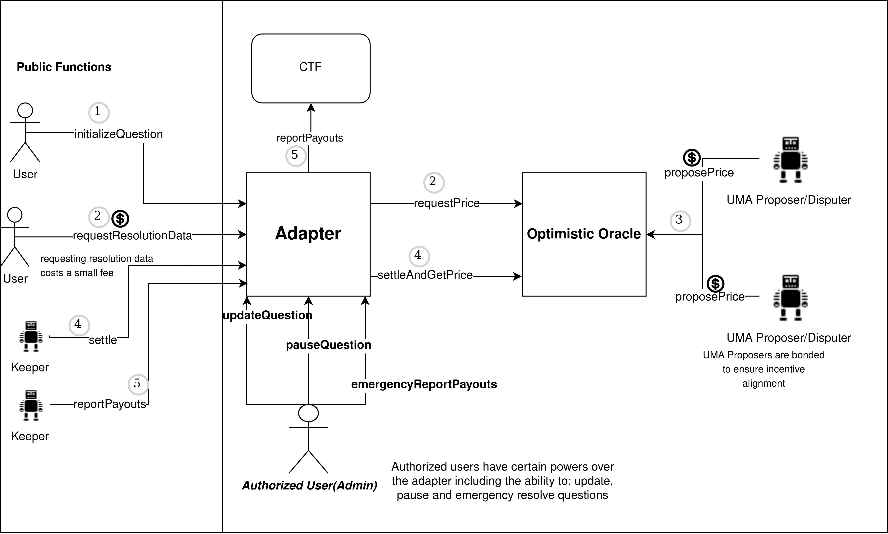

# Polymarket UMA CTF Adapter

## Overview

This repository contains contracts used to resolve [Polymarket](https://polymarket.com/) prediction markets via UMA's [optimistic oracle](https://docs.umaproject.org/oracle/optimistic-oracle-interface).

### [Architecture](./docs/Architecture.md)

### Deployments

See ./deploys.md

### Dependencies

Install dependencies with `yarn install`

### Compile

Compile the contracts with `yarn compile`

### Testing

Test the contracts with `yarn test`

### Coverage

Generate coverage reports with `yarn coverage`
